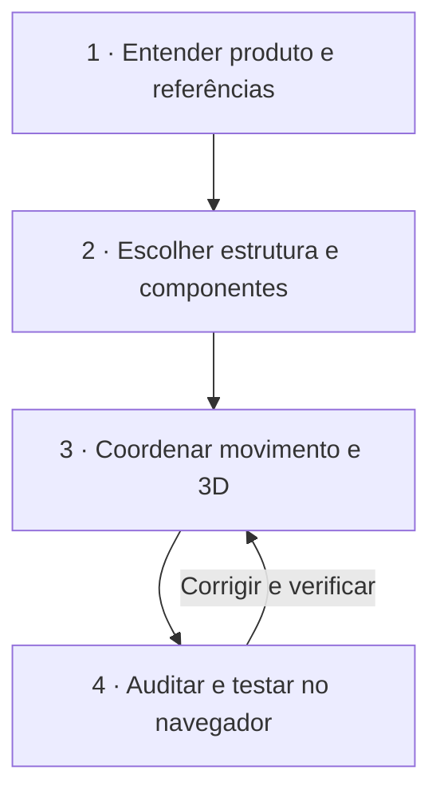

# Orchestrator Pipeline

**Uma direção. Várias especialidades. Evidência no navegador.**

[Português (BR)](README.md) · [English](docs/README.en.md) · [Español](docs/README.es.md)

O Orchestrator Pipeline é uma skill aberta para agentes que implementam interfaces. Ela coordena direção visual, componentes, movimento, 3D e validação em um fluxo de quatro etapas. O objetivo é fazer cada ferramenta resolver o problema para o qual ela serve e entregar uma interface coerente, funcional e verificável.

> Uma experiência memorável não nasce da soma de efeitos. Nasce de decisões que se sustentam juntas.

## Instalação em um comando

Node.js 20+ e Git são necessários. Execute na pasta do projeto:

```bash
npx --yes --package=github:klebr55/orchestrator-pipeline-skill orchestrator-pipeline install --agent codex
```

O comando instala **nove skills**: esta skill e oito skills complementares, diretamente dos repositórios de seus respectivos autores. Para disponibilizá-las em todos os projetos, acrescente `--global`. Para outro agente compatível com o [Skills CLI](https://github.com/vercel-labs/skills), troque `codex` por `antigravity`, `cursor`, `claude-code` ou seu identificador. Veja os comandos antes de executar com `--dry-run`.

Com npm, o mesmo fluxo é:

```bash
npm exec --yes --package=github:klebr55/orchestrator-pipeline-skill -- orchestrator-pipeline install --agent codex
```

Este pacote pode ser executado diretamente do GitHub; **não depende de publicação no registro npm**. A instalação usa `npx skills@latest add` para cada origem e para se no primeiro erro. Se uma origem falhar, corrija o acesso e repita o comando. O instalador não pede licença paga e não copia as skills de terceiros para este repositório.

## O que entra no conjunto

| Skill | Papel no trabalho | Fonte |
| --- | --- | --- |
| Orchestrator Pipeline | Decide a sequência, resolve conflitos e exige evidência | [Este repositório](skills/orchestrator-pipeline/SKILL.md) |
| Taste Skill | Lê público, marca e linguagem visual em páginas e redesigns | [Leonxlnx](https://github.com/Leonxlnx/taste-skill) |
| Build Awwwards-Quality Sites | Define conceito, narrativa, mídia e qualidade expressiva | [MengTo](https://github.com/MengTo/Skills) |
| Animate | Decide quando animar e como uma interação deve se comportar | [Emil Kowalski](https://github.com/emilkowalski/skills) |
| Web Design Guidelines | Audita semântica, usabilidade, acessibilidade e responsividade | [Vercel](https://github.com/vercel-labs/agent-skills) |
| Three.js Best Practices | Orienta cenas, shaders, recursos e desempenho | [emalorenzo](https://github.com/emalorenzo/three-agent-skills) |
| R3F Best Practices | Orienta `Canvas`, `useFrame`, estados e ciclo de vida em React | [emalorenzo](https://github.com/emalorenzo/three-agent-skills) |
| shadcn | Apoia descoberta e integração de componentes e registros | [shadcn/ui](https://ui.shadcn.com/docs/skills) |
| Playwright CLI | Orienta a inspeção do navegador com comandos concisos | [Microsoft](https://github.com/microsoft/playwright-cli) |

As skills de Three.js e R3F são instaladas juntas, mas só devem ser carregadas quando houver trabalho 3D relevante. Taste não impõe estética de landing page a um painel administrativo. React Bits é um **registro de componentes**, consultado pelo shadcn MCP; não é uma skill obrigatória adicional.

## Como o pipeline trabalha



1. **Ler antes de desenhar.** O worker examina usuários, fluxos, identidade, código existente e referências. Registra uma tese visual e por que cada efeito ou cena merece existir.
2. **Escolher componentes pelo trabalho que fazem.** Usa a biblioteca existente e primitivos acessíveis. Consulta o [React Bits gratuito](https://www.reactbits.dev/get-started/mcp) pelo shadcn MCP quando um componente expressivo ajuda a narrativa; avalia código, dependências, teclado, toque, movimento reduzido e custo.
3. **Dar um dono a cada movimento.** GSAP, CSS, React Bits e o loop do R3F não disputam a mesma propriedade. Cenas 3D preservam conteúdo sem WebGL, quadro estático, desligamento correto e caminho acessível.
4. **Verificar o que foi construído.** O Playwright CLI conduz as rotas, estados, interações e capturas rotineiras. O Chrome DevTools MCP aprofunda console, rede e traces quando a investigação pede isso. O custo em tokens importa, mas não impede o uso de uma ferramenta que produza a evidência necessária.

As referências visuais são estudadas por princípios de hierarquia, ritmo e interação. O pipeline não orienta copiar identidade, código ou assets de outros sites.

## Preparar ferramentas do navegador e componentes

O instalador acima instala **instruções de skill**. Executáveis, navegadores e servidores MCP dependem do ambiente do agente e precisam de configuração própria:

- [Playwright CLI](https://github.com/microsoft/playwright-cli): instale ou disponibilize `@playwright/cli` e o navegador conforme a documentação oficial.
- [shadcn MCP](https://ui.shadcn.com/docs/mcp): conecte o servidor ao cliente de IA. Em um projeto React com `components.json`, adicione o registro gratuito sem apagar outros registros:

  ```json
  {"registries":{"@react-bits":"https://reactbits.dev/r/{name}.json"}}
  ```

- [Chrome DevTools MCP](https://github.com/ChromeDevTools/chrome-devtools-mcp): conecte quando seus recursos de depuração profunda forem úteis. Sua ausência não invalida verificações que o Playwright consegue executar; o worker deve declarar quais diagnósticos ficaram pendentes.

O instalador não altera arquivos de configuração de MCP nem instala componentes React em um projeto antes de entender a arquitetura dele.

## Uso com um worker

```text
Use @orchestrator-pipeline neste trabalho de interface.
Inspecione o projeto e as referências antes de propor a direção visual.
Escolha componentes pelo papel funcional, coordene movimento e 3D quando fizer sentido,
e entregue os quatro checkpoints com testes e evidência no navegador.
```

O [arquivo da skill](skills/orchestrator-pipeline/SKILL.md) contém o roteiro completo e um modelo de repasse ao worker. A instalação na pasta do projeto é a opção padrão; ela evita mexer nas skills globais. Para conferir o resultado, use `npx skills ls -a codex` (ou acrescente `-g` para o escopo global).

## Limites e autoria

Este repositório distribui apenas a skill original e seu instalador. As oito skills complementares pertencem a seus respectivos autores e são baixadas das fontes listadas acima, sujeitas às licenças de cada projeto. O nome “Awwwards” expressa uma meta de qualidade, não uma certificação ou prêmio.

Contribuições são bem-vindas: descreva o problema, o contexto da interface e a evidência de que a mudança melhora o fluxo. Código e documentação deste repositório: [MIT](LICENSE).
