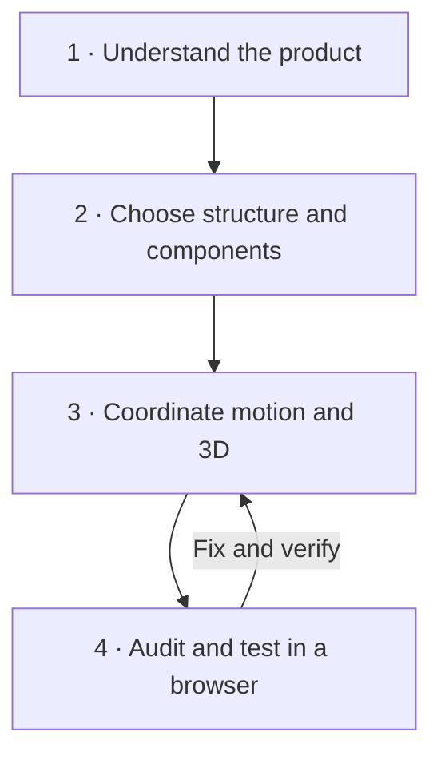

# Orchestrator Pipeline

**One direction. Many specialties. Browser evidence.**

[Português (BR)](../README.md) · [English](README.en.md) · [Español](README.es.md)

Orchestrator Pipeline is an open skill for agents building interfaces. It coordinates visual direction, components, motion, 3D, and validation through four stages. Each tool has a clear job, and the result must be coherent, functional, and verifiable.

> Memorable experiences do not come from piling up effects. They come from decisions that work together.

## Install in one command

Requires Node.js 20+ and Git. Run inside your project:

```bash
npx --yes --package=github:klebr55/orchestrator-pipeline-skill orchestrator-pipeline install --agent codex
```

This installs **nine skills**: the orchestrator and eight companion skills, directly from their authors' repositories. Add `--global` for use across projects. Replace `codex` with `antigravity`, `cursor`, `claude-code`, or another [Skills CLI](https://github.com/vercel-labs/skills) agent ID. Add `--dry-run` to inspect every command first.

The equivalent npm command is:

```bash
npm exec --yes --package=github:klebr55/orchestrator-pipeline-skill -- orchestrator-pipeline install --agent codex
```

The package runs from GitHub and **does not require publication to the npm registry**. It invokes `npx skills@latest add` for each upstream source and stops on the first error. Fix access and rerun the command if a source fails. No paid license is required; this repository does not redistribute third-party skill content.

## The ensemble

| Skill | Responsibility | Source |
| --- | --- | --- |
| Orchestrator Pipeline | Sequence decisions, reconcile conflicts, demand evidence | [This repository](../skills/orchestrator-pipeline/SKILL.md) |
| Taste Skill | Read audience, brand, and visual language for pages and redesigns | [Leonxlnx](https://github.com/Leonxlnx/taste-skill) |
| Build Awwwards-Quality Sites | Develop an expressive concept, narrative, and media system | [MengTo](https://github.com/MengTo/Skills) |
| Animate | Decide whether, why, and how interactions animate | [Emil Kowalski](https://github.com/emilkowalski/skills) |
| Web Design Guidelines | Audit semantics, usability, accessibility, and responsive behavior | [Vercel](https://github.com/vercel-labs/agent-skills) |
| Three.js Best Practices | Guide scenes, shaders, resources, and performance | [emalorenzo](https://github.com/emalorenzo/three-agent-skills) |
| R3F Best Practices | Guide `Canvas`, `useFrame`, state, and React lifecycle | [emalorenzo](https://github.com/emalorenzo/three-agent-skills) |
| shadcn | Guide component and registry discovery and integration | [shadcn/ui](https://ui.shadcn.com/docs/skills) |
| Playwright CLI | Guide focused browser inspection through concise commands | [Microsoft](https://github.com/microsoft/playwright-cli) |

The 3D skills are installed together but loaded only when relevant. Taste does not impose a landing-page aesthetic on a dashboard. React Bits is a **component registry** available through shadcn MCP, not another mandatory skill.

## The four-stage workflow



1. **Read before designing.** Inspect users, flows, identity, code, and references. State a visual thesis and a reason for every significant effect or scene.
2. **Choose components for their purpose.** Favor the existing system and accessible primitives. Browse [free React Bits](https://www.reactbits.dev/get-started/mcp) through shadcn MCP when expressive motion serves the story. Inspect source, dependencies, keyboard and touch support, reduced motion, and runtime cost.
3. **Give each motion one owner.** GSAP, CSS, React Bits, and the R3F frame loop must not compete for the same property. A 3D scene needs semantic content, a static first frame, fallback, and cleanup.
4. **Test what actually runs.** Playwright CLI handles routine routes, states, interactions, and screenshots. Chrome DevTools MCP provides deeper console, network, and performance evidence when needed. Token cost informs scope; it does not prohibit a useful investigation.

References inspire principles of hierarchy, pacing, and interaction. The skill never asks a worker to copy another site's identity, code, or assets.

## Set up browser and component tools

The installer installs **skill instructions**. Browser executables and MCP servers have their own environment-specific setup:

- [Playwright CLI](https://github.com/microsoft/playwright-cli): make `@playwright/cli` and a browser available according to the official guide.
- [shadcn MCP](https://ui.shadcn.com/docs/mcp): connect the server to your AI client. In a React project with `components.json`, merge this free registry with existing entries:

  ```json
  {"registries":{"@react-bits":"https://reactbits.dev/r/{name}.json"}}
  ```

- [Chrome DevTools MCP](https://github.com/ChromeDevTools/chrome-devtools-mcp): connect it for deep debugging when useful. If unavailable, report the specific diagnostics that remain unverified.

The installer never rewrites MCP client configuration or adds React components before the project's architecture is understood.

## Ask a worker

```text
Use @orchestrator-pipeline for this interface task.
Inspect the project and references before setting the visual direction.
Choose components by purpose, coordinate motion and 3D when justified,
and report all four checkpoints with test results and browser evidence.
```

Read the complete [skill and worker handoff](../skills/orchestrator-pipeline/SKILL.md). Project scope is the default, so global skills remain untouched. Verify with `npx skills ls -a codex` (add `-g` for global scope).

## Ownership and limits

This repository distributes only the original orchestrator and installer. Companion skills remain with their authors and are fetched from the listed sources under their respective licenses. “Awwwards” describes a quality aspiration, not an award or endorsement. Contributions with a concrete interface problem and evidence of improvement are welcome. This repository's code and documentation use the [MIT license](../LICENSE).
