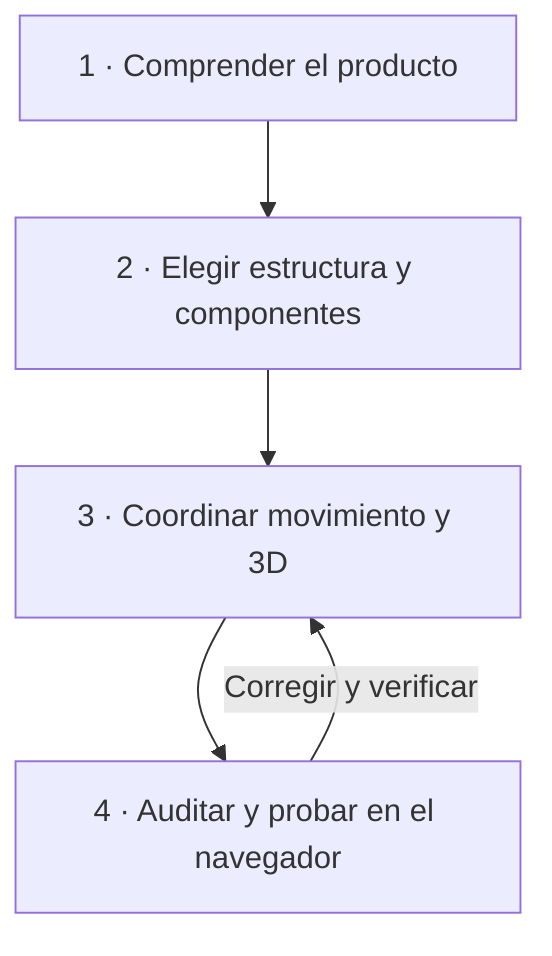

<p align="center"></p>

# Orchestrator Pipeline

**Una dirección. Varias especialidades. Evidencia en el navegador.**

[English](../README.md) · [Português (BR)](README.pt-BR.md) · **Español**

Orchestrator Pipeline es una skill abierta para agentes que implementan interfaces. Coordina dirección visual, componentes, movimiento, 3D y validación en cuatro etapas. Cada herramienta cumple una función clara y el resultado debe ser coherente, funcional y verificable.

> Una experiencia memorable no nace de acumular efectos. Nace de decisiones que funcionan juntas.

## Instalación en un comando

Necesitas Node.js 20+ y Git. Ejecuta en la carpeta de tu proyecto:

```bash
npx --yes --package=github:klebr55/orchestrator-pipeline-skill orchestrator-pipeline install --agent codex
```

Se instalan **nueve skills**: esta y ocho complementarias, directamente desde los repositorios de sus autores. Añade `--global` para utilizarlas en todos tus proyectos. Sustituye `codex` por `antigravity`, `cursor`, `claude-code` u otro identificador compatible con [Skills CLI](https://github.com/vercel-labs/skills). Usa `--dry-run` para revisar los comandos antes de ejecutarlos.

Con npm, el mismo proceso es:

```bash
npm exec --yes --package=github:klebr55/orchestrator-pipeline-skill -- orchestrator-pipeline install --agent codex
```

El paquete se ejecuta desde GitHub y **no necesita publicarse en el registro npm**. Ejecuta `npm exec --package=skills@latest -- skills add` para cada origen y se detiene en el primer error. Si falla uno, corrige el acceso y vuelve a ejecutar el comando. No requiere una licencia de pago ni redistribuye aquí el contenido de terceros.

Después de la primera publicación en npm, también podrás usar `npx --yes --package=@klebr55/orchestrator-pipeline-skill orchestrator-pipeline install --agent codex`. Hasta entonces, usa los comandos de GitHub anteriores.

## Las piezas del conjunto

| Skill | Función | Fuente |
| --- | --- | --- |
| Orchestrator Pipeline | Ordena decisiones, resuelve conflictos y exige evidencia | [Este repositorio](../skills/orchestrator-pipeline/SKILL.md) |
| Taste Skill | Interpreta público, marca y lenguaje visual en páginas y rediseños | [Leonxlnx](https://github.com/Leonxlnx/taste-skill) |
| Build Awwwards-Quality Sites | Define concepto expresivo, narrativa y medios | [MengTo](https://github.com/MengTo/Skills) |
| Animate | Decide si, por qué y cómo debe animarse una interacción | [Emil Kowalski](https://github.com/emilkowalski/skills) |
| Web Design Guidelines | Audita semántica, usabilidad, accesibilidad y adaptación | [Vercel](https://github.com/vercel-labs/agent-skills) |
| Three.js Best Practices | Orienta escenas, shaders, recursos y rendimiento | [emalorenzo](https://github.com/emalorenzo/three-agent-skills) |
| R3F Best Practices | Orienta `Canvas`, `useFrame`, estado y ciclo de vida en React | [emalorenzo](https://github.com/emalorenzo/three-agent-skills) |
| shadcn | Ayuda a descubrir e integrar componentes y registros | [shadcn/ui](https://ui.shadcn.com/docs/skills) |
| Playwright CLI | Orienta la inspección del navegador con comandos concisos | [Microsoft](https://github.com/microsoft/playwright-cli) |

Las skills de 3D se instalan juntas, pero solo se cargan cuando el trabajo lo requiere. Taste no impone una estética de landing page a un panel administrativo. React Bits es un **registro de componentes** accesible mediante shadcn MCP, no otra skill obligatoria.

## Las cuatro etapas

<p align="center"></p>



1. **Leer antes de diseñar.** Examinar usuarios, flujos, identidad, código y referencias. Explicar la dirección visual y el motivo de cada efecto o escena importante.
2. **Elegir componentes por su función.** Priorizar el sistema existente y los componentes accesibles. Consultar [React Bits gratuito](https://www.reactbits.dev/get-started/mcp) mediante shadcn MCP cuando el movimiento aporte a la narrativa. Revisar código, dependencias, teclado, tacto, movimiento reducido y coste de ejecución.
3. **Asignar un dueño a cada movimiento.** GSAP, CSS, React Bits y el ciclo de R3F no deben modificar la misma propiedad de forma independiente. Una escena 3D necesita contenido semántico, imagen inicial estática, alternativa y limpieza de recursos.
4. **Probar el resultado real.** Playwright CLI cubre rutas, estados, interacciones y capturas habituales. Chrome DevTools MCP profundiza en consola, red y rendimiento cuando hace falta. El coste de tokens guía el alcance, pero no impide una investigación útil.

Las referencias inspiran principios de jerarquía, ritmo e interacción; la skill no pide copiar identidad, código ni recursos de otros sitios.

## Configurar las herramientas

El instalador instala **instrucciones de skill**. Los ejecutables del navegador y los servidores MCP requieren configuración específica del entorno:

- [Playwright CLI](https://github.com/microsoft/playwright-cli): instala o habilita `@playwright/cli` y un navegador según la guía oficial.
- [shadcn MCP](https://ui.shadcn.com/docs/mcp): conecta el servidor al cliente de IA. En un proyecto React con `components.json`, agrega este registro gratuito sin borrar los demás:

  ```json
  {"registries":{"@react-bits":"https://reactbits.dev/r/{name}.json"}}
  ```

- [Chrome DevTools MCP](https://github.com/ChromeDevTools/chrome-devtools-mcp): conéctalo para una depuración profunda cuando sea útil. Si no está disponible, informa qué diagnósticos quedan pendientes.

El instalador no modifica la configuración MCP ni añade componentes React antes de comprender la arquitectura del proyecto.

## Encargo a un worker

```text
Usa @orchestrator-pipeline para esta interfaz.
Examina el proyecto y las referencias antes de definir la dirección visual.
Elige componentes por su función, coordina movimiento y 3D cuando se justifique,
y entrega las cuatro etapas con pruebas y evidencia del navegador.
```

Consulta la [skill completa y su plantilla para workers](../skills/orchestrator-pipeline/SKILL.md). Por defecto, la instalación se limita al proyecto y no modifica las skills globales. Comprueba el resultado con `npx skills ls -a codex` (añade `-g` para el ámbito global).

## Publicar en npm

La cuenta que publique necesita permiso en el ámbito npm `@klebr55`. Si `npm whoami` muestra otra cuenta, esta debe pertenecer a la organización npm `klebr55` con permiso de publicación; otra opción es cambiar el ámbito del paquete y empaquetarlo de nuevo. Ejecuta `npm login` en tu equipo, confirma con `npm whoami`, ejecuta `npm test` y `npm pack --dry-run`, revisa los archivos y publica la primera versión con `npm publish --access public`. Nunca compartas contraseñas ni tokens en el chat. Después, configura [trusted publishing de npm](https://docs.npmjs.com/trusted-publishers/) para el workflow manual `.github/workflows/publish.yml`. Consulta la [guía completa en inglés](../README.md#publish-to-npm).

## Autoría y límites

Este repositorio distribuye únicamente la skill original y su instalador. Las ocho skills complementarias siguen en manos de sus autores y se descargan desde las fuentes indicadas, bajo sus respectivas licencias. “Awwwards” expresa una aspiración de calidad, no un premio ni un respaldo oficial. Se agradecen contribuciones con un problema concreto y pruebas de la mejora. El código y la documentación de este repositorio tienen [licencia MIT](../LICENSE).
